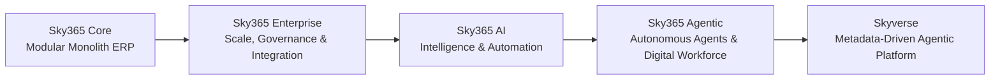

# Sky365 Brand Architecture

## 1. Brand Model

Sky365 uses a **branded-house architecture**.

- **Master brand:** Sky365
- **Product evolution layers:** Core, Enterprise, AI, Agentic, Skyverse
- **End-state platform:** Skyverse by Sky365

This avoids creating five disconnected brands while preserving clear commercial packaging and technical progression.

## 2. Product Evolution Timeline



## 3. Layer Definitions

### Sky365 Core
Operational foundation for finance, inventory, sales, purchasing, HR, CRM and business workflows.

### Sky365 Enterprise
Adds governance, advanced permissions, multi-company operations, compliance, integrations, scalability and performance controls.

### Sky365 AI
Adds copilots, knowledge, RAG, semantic search, smart analytics, recommendations and productivity automation.

### Sky365 Agentic
Moves from assistance to execution through multi-agent runtime, skills, tools, workflows, orchestration, collaboration and digital workforce capabilities.

### Skyverse
The highest product evolution. A metadata-driven platform that composes applications, agents, workflows, context, memory, data and connected experiences.

## 4. Relationship Rules

1. Every edition keeps the **Sky365** master-brand endorsement.
2. Skyverse may appear as **Skyverse by Sky365** in external campaigns until market recognition is established.
3. Agentic is a distinct commercial and capability layer before Skyverse.
4. Skyverse also contains agentic capabilities; this is not duplication. Agentic packages the execution layer, while Skyverse packages the full metadata-driven experience universe.
5. Edition names must never be written as unrelated standalone companies.

## 5. Naming Ladder

```text
Operate → Govern → Understand → Execute → Compose
Core      Enterprise  AI       Agentic   Skyverse
```

## 6. Governance

Any change to edition count, order or meaning requires:

- an ADR;
- updated messaging matrix;
- updated landing page;
- updated logo family;
- updated motion and GIF assets;
- migration notes for old visuals.
