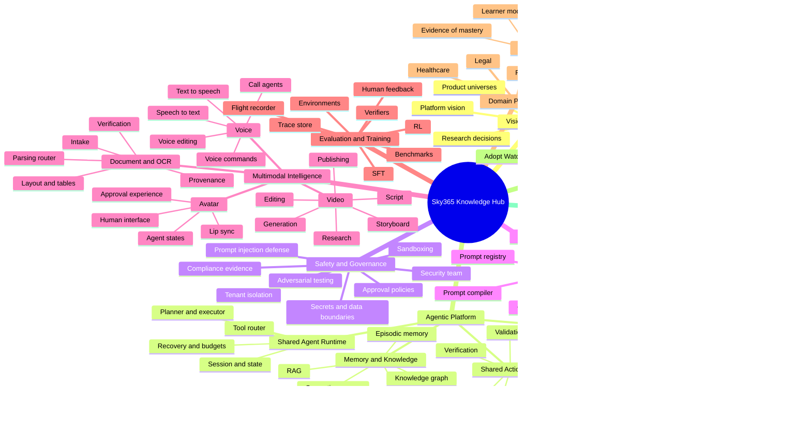
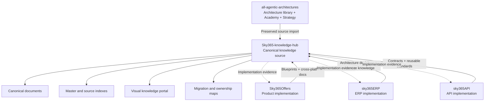

# Sky365 Knowledge Hub — Master Mind Map

> The top-down navigation map for Sky365 architecture, engineering knowledge, research, learning, and implementation evidence.

## Whole-platform map



## Repository relationship map



## Canonical information flow

```text
Research or external idea
→ Verification
→ Capability classification
→ Existing implementation check
→ Reuse / Extend / Complete / Merge / Deprecate / Build
→ Blueprint or ADR
→ Repository implementation
→ Runtime evidence and tests
→ Canonical status update
→ Learning and visual documentation
```

## Anti-duplication rule

Before creating or moving any document:

1. Search all registered source repositories.
2. Identify every version and original index entry.
3. Preserve the source copy and provenance.
4. Select or merge a canonical version.
5. Update both the master index and the source index.
6. Link canonical claims to implementation evidence.

A new document is the final option, not the default action.
