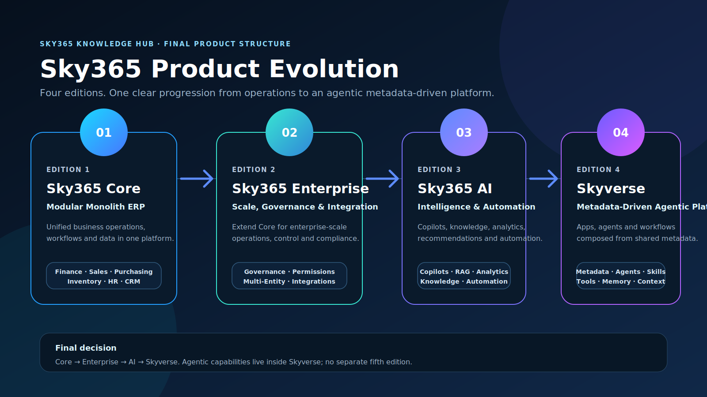
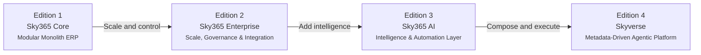

# Sky365 Product Evolution

> **Decision status:** Final agreed edition structure  
> **Repository:** Sky365 Knowledge Hub  
> **Date:** 2026-07-19

## Final Timeline

## Edition Matrix

| Edition | Product Name | Primary Positioning | Core Capabilities |
|---|---|---|---|
| 1 | **Sky365 Core** | Modular Monolith ERP | Finance, sales, purchasing, inventory, HR, CRM, operational workflows and shared data |
| 2 | **Sky365 Enterprise** | Scale, Governance & Integration | Governance, advanced permissions, multi-entity operations, integrations, compliance and enterprise controls |
| 3 | **Sky365 AI** | Intelligence & Automation Layer | Copilots, knowledge, RAG, analytics, recommendations and intelligent automation |
| 4 | **Skyverse** | Metadata-Driven Agentic Platform | Metadata-driven applications, agents, skills, tools, workflows, context graph, memory and connected experiences |

## Product Logic

### 1. Sky365 Core

**Positioning:** Modular Monolith ERP.

Core is the operational foundation. It unifies business operations, workflows and data in one platform.

### 2. Sky365 Enterprise

**Positioning:** Scale, Governance & Integration.

Enterprise extends Core for larger organizations. It adds governance, control, compliance, deep integrations and multi-entity operations.

### 3. Sky365 AI

**Positioning:** Intelligence & Automation Layer.

AI adds copilots, knowledge retrieval, analytics, recommendations and automation on top of the enterprise platform.

### 4. Skyverse

**Positioning:** Metadata-Driven Agentic Platform.

Skyverse is the highest evolution of the platform. It composes applications, agents, workflows and connected experiences from shared metadata.

**Canonical description:**

> Build applications, agents, workflows and connected experiences from shared metadata.

## Architecture Decision

### ADR: Keep the product family to four editions

**Decision**

Use four editions only:

1. Sky365 Core
2. Sky365 Enterprise
3. Sky365 AI
4. Skyverse

**Rationale**

- Four editions are easier to explain, build, support and market.
- Enterprise must precede AI because governance, scale and integration are platform prerequisites.
- Agentic capabilities are not maintained as a separate fifth edition.
- Agentic runtime, skills, tools, context graph and memory belong inside Skyverse.
- Skyverse represents the metadata-driven and agentic destination of the ecosystem.

**Rejected structure**

`Core → AI → Agentic → Enterprise → Skyverse`

This structure was rejected because it creates overlapping product boundaries, places Enterprise too late and exceeds the team's realistic capacity to maintain distinct editions.

## Naming Rules

- Use **Sky365**, not alternative spellings.
- Use **Sky365 Core**, **Sky365 Enterprise** and **Sky365 AI**.
- Use **Skyverse** as the fourth and highest edition.
- Do not create a separate **Sky365 Agentic** edition.
- Describe Skyverse as **Metadata-Driven Agentic Platform**.

## Implementation Checklist

- [x] Confirm the four-edition structure.
- [x] Document the edition order and responsibilities.
- [x] Create a visual mind map and timeline.
- [ ] Align the four promotional edition images with the final order.
- [ ] Produce the final animated GIF from the approved images.
- [ ] Keep the Knowledge Hub landing-page card linked to this document.
