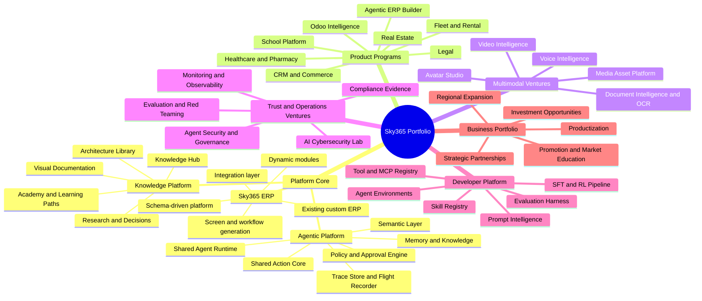

# Sky365 Project Portfolio and Investment Mind Map

> Executive map connecting Sky365 products, engineering programs, implementation evidence, development gaps, and investment opportunities.

## 1. Purpose

This document answers five questions:

1. What are we building?
2. What is already implemented, partially implemented, documented, or still unverified?
3. How does the current custom ERP evolve into the Sky365 schema-driven platform?
4. Which development programs should be prioritized next?
5. Which product programs can become investable ventures or strategic partnerships?

## 2. Evidence rule

Every project status must be one of:

- **Verified implemented** — supported by code, database, runtime, tests, or deployment evidence.
- **Partial implementation** — some components exist, but the end-to-end capability is incomplete.
- **Prototype** — demonstrable experiment without production evidence.
- **Documented only** — blueprint, research, or roadmap exists without verified implementation.
- **Unverified** — mentioned in strategy but not yet checked in source repositories.

No project may be promoted as production-ready based only on a blueprint or landing page.

## 3. Whole portfolio mind map



## 4. Current strategic interpretation

### 4.1 Knowledge Hub

**Role:** canonical map of architecture, research, decisions, roadmaps, and evidence links.

**Current status:** partial foundation.

**Existing:** repository structure, master index, source registry, migration policy, master capability mind map, GitHub Pages workflow.

**Missing:** full source snapshots, duplicate map, implementation evidence registry, project-status matrix, investor portfolio, repository dashboards, and automatic synchronization.

### 4.2 Agentic Platform

**Role:** common runtime serving all Sky365 agents.

**Known architectural direction:**

- Shared Agent Runtime
- Shared Action Core
- Policy Engine
- Approval gates
- DraftOnly execution
- Tool registry
- Trace store
- Verifiers
- Semantic layer
- Memory and RAG

**Current status:** mixed and requires repository audit.

Known prior implementation signals include Mascot Agent routes, deterministic fallback, audit traces, draft-only safety, and supplier-approval reference work. These claims must be revalidated against current code and runtime before final classification.

### 4.3 ERP transformation

The transformation should not be described as replacing the existing ERP with a new application. The target is a controlled evolution:

```text
Existing custom ERP
→ schema discovery
→ canonical business model
→ semantic dictionary
→ module registry
→ screen and workflow metadata
→ Shared Action Core
→ dynamic module and page generation
→ agent-controlled operations
```

#### Required transformation layers

1. **Legacy discovery layer**
   - Database schemas
   - Stored procedures
   - Routes and controllers
   - Screens and reports
   - Roles and permissions
   - Actual usage patterns

2. **Canonical schema layer**
   - Entities
   - Fields and types
   - Relationships
   - Commands and events
   - Validation rules
   - Permissions
   - Audit requirements

3. **Module registry**
   - Module identity
   - Capabilities
   - Screens
   - Workflows
   - Reports
   - APIs
   - Tools
   - Skills
   - Policies

4. **Dynamic experience layer**
   - Overview pages
   - Generated forms and lists
   - Domain dashboards
   - Workflow visualization
   - Agent-assisted navigation

5. **Safe execution layer**
   - Intent classification
   - Risk classification
   - Draft action
   - Approval
   - Execution
   - Verification
   - Rollback and audit

## 5. Module assessment framework

A definitive list of working and missing modules cannot be produced from the Knowledge Hub alone. It must be generated from source repositories and runtime evidence.

The audit matrix must contain:

| Module | Repository | DB evidence | UI evidence | API evidence | Runtime evidence | Documentation | Status | Gap | Decision |
|---|---|---:|---:|---:|---:|---:|---|---|---|
| Core ERP | TBD | TBD | TBD | TBD | TBD | Partial | Unverified | Audit required | Check |
| CRM | TBD | TBD | TBD | TBD | TBD | Mentioned | Unverified | Audit required | Check |
| Offers | Sky365Offers | TBD | TBD | TBD | TBD | Present | Partial | Verify end-to-end | Extend |
| School | Sky365Offers / other | TBD | TBD | TBD | TBD | Blueprint | Partial or documented | Legacy bridge audit | Discover |
| Odoo integration | TBD | TBD | TBD | TBD | TBD | Research and prompts | Unverified | Integration inventory | Check |
| Commerce | TBD | TBD | TBD | TBD | TBD | Strategy | Unverified | Connector audit | Check |
| Healthcare | TBD | TBD | TBD | TBD | TBD | Strategy | Unverified | Domain-pack audit | Check |
| Legal | TBD | TBD | TBD | TBD | TBD | Strategy | Unverified | Domain-pack audit | Check |
| Fleet and rental | TBD | TBD | TBD | TBD | TBD | Strategy | Unverified | Domain-pack audit | Check |

## 6. Development programs

### Program A — Repository and Runtime Discovery

Goal: know what exists before building.

Deliverables:

- Repository snapshot inventory
- Local-project inventory
- Database and API map
- Module matrix
- Duplicate documentation map
- Runtime evidence registry

### Program B — Schema-Driven ERP Foundation

Goal: convert legacy/custom ERP knowledge into a reusable canonical model.

Deliverables:

- Canonical schema
- Semantic dictionary
- Module registry
- Screen registry
- Workflow registry
- Report registry
- Legacy bridge contracts

### Program C — Safe Agentic Execution

Goal: make every AI action controlled and auditable.

Deliverables:

- Shared Action Core
- Policy Engine
- Approval Manager
- Tool permissions
- Trace Store
- Verifiers
- Rollback strategy

### Program D — Multimodal Intelligence

Goal: create reusable document, voice, video, and avatar services.

Deliverables:

- Document Intelligence and OCR router
- Voice pipeline
- Video planning and assembly pipeline
- Avatar runtime
- Media asset registry
- Multimodal evaluation

### Program E — Trust, Security, and Monitoring

Goal: productize safety and observability.

Deliverables:

- AI Security Lab
- Prompt-injection defense
- Tenant and secrets isolation
- Agent red-team harness
- Monitoring and observability platform
- Compliance and evidence dashboard

### Program F — Developer and Training Platform

Goal: turn traces and environments into continuous improvement.

Deliverables:

- Prompt registry
- Skill registry
- Tool and MCP registry
- Evaluation harness
- Agent environments
- Trace datasets
- Human feedback
- SFT and controlled RL pipeline

## 7. Investment opportunity map

### Venture 1 — Sky365 Agentic ERP

**Customer:** SMEs, regional enterprises, ERP implementers, vertical software partners.

**Investment thesis:** transform static ERP implementations into governed agentic operations and schema-driven modules.

**Required proof:** one deep reference workflow, measurable implementation time reduction, safe action execution, and repeatable module generation.

### Venture 2 — Sky365 Document Intelligence and OCR

**Customer:** finance teams, legal firms, healthcare, education, government, ERP vendors.

**Investment thesis:** Arabic/English document understanding connected to verified business actions rather than raw OCR text.

**Required proof:** benchmark corpus, field and table accuracy, provenance, cost model, and first invoice/contract workflow.

### Venture 3 — Sky365 AI Cybersecurity Lab

**Customer:** enterprises adopting agents, software vendors, regulated sectors.

**Investment thesis:** security, red teaming, policy testing, prompt-injection defense, and agent governance become a dedicated product line.

**Required proof:** attack library, measurable controls, security scorecard, and pilot customers.

### Venture 4 — Sky365 Agent Observatory

**Customer:** companies running internal or customer-facing AI agents.

**Investment thesis:** unified traces, tool calls, cost, latency, risk, approvals, and outcome monitoring.

**Required proof:** live dashboard, cross-agent trace ingestion, alerting, replay, and evaluation.

### Venture 5 — Sky365 Voice and Video Studio

**Customer:** training, marketing, customer support, education, product teams.

**Investment thesis:** governed content pipeline from research to script, voice, avatar, video, approval, and publishing.

**Required proof:** repeatable production workflow, quality controls, content provenance, and unit economics.

### Venture 6 — Sky365 School Intelligence

**Customer:** schools, training centers, education networks.

**Investment thesis:** legacy-school bridge plus curriculum graph, learner model, evidence of mastery, and governed automation.

**Required proof:** one school deployment, migration map, teacher workflow, and measurable administrative or learning improvement.

## 8. Recommended sequencing

```text
1. Discovery and module evidence
2. Shared Action Core and Trace Store
3. Schema-driven ERP reference module
4. Agent Observatory
5. Document Intelligence reference workflow
6. AI Security Lab
7. School or vertical pilot
8. Voice and Video Studio
9. Training and RL platform
```

The first investment narrative should not present all programs as equally mature. It should distinguish:

- Core platform
- Near-term products
- Incubation ventures
- Research tracks

## 9. Promotion and market-education program

Promotion should be based on verified demonstrations:

- Architecture explainers
- Reference workflow videos
- Security and governance demonstrations
- Before/after ERP implementation stories
- OCR benchmark reports
- Monitoring dashboards
- Vertical pilot case studies
- Investor data room

## 10. Immediate next evidence tasks

1. Snapshot and index the four registered repositories.
2. Build the verified module matrix.
3. Map every blueprint to repository and runtime evidence.
4. Select one schema-driven ERP golden module.
5. Select one document-intelligence workflow.
6. Define the Agent Observatory MVP.
7. Define the AI Security Lab MVP.
8. Produce investor readiness scores for every venture.
