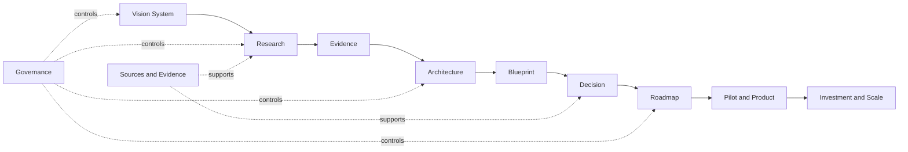

# SKY365 Vision Architecture

## Purpose

SKY365 does not rely on one oversized vision statement. It uses a governed system of complementary visions that describe the same ecosystem from different strategic perspectives.

## Vision hierarchy

### 1. Ecosystem Vision
Defines why SKY365 exists and how ERP, AI, agentic workflows, integrations, knowledge, automation, analytics, and digital workforce capabilities operate as one ecosystem.

### 2. Business Vision
Defines target customers, commercial value, market positioning, revenue models, partnerships, and geographic expansion.

### 3. Product Vision
Defines the products, user outcomes, editions, modules, and connected experiences delivered through SKY365 SaaS, SKY365 AI, and SKY365 Agentic.

### 4. Technology Vision
Defines the modular, API-first, cloud, on-premise, and hybrid platform model, including integration, semantic, observability, data, and security foundations.

### 5. Agentic AI Vision
Defines agents, skills, tools, memory, context, MCP, approvals, human-in-the-loop controls, auditability, evaluation, and safety.

### 6. Knowledge Vision
Defines how distributed information becomes research, evidence, decisions, blueprints, reusable knowledge, and implementation guidance.

### 7. Customer Experience Vision
Defines a unified journey across web, mobile, messaging, voice, and enterprise interfaces from question to decision, action, and follow-up.

### 8. Industry Visions
Defines sector-specific applications for healthcare, real estate, fleet and rental, legal services, commerce, and government.

### 9. Investment Vision
Defines investable assets, separable products, venture opportunities, growth stages, capital needs, partnership models, and expected scale paths.

### 10. Delivery Vision
Defines how ideas move through research, evidence, architecture, decisions, roadmaps, pilots, products, and scale.

## Required structure for every vision

Each vision document must contain:

1. Purpose
2. Future state
3. Target audience
4. Strategic outcomes
5. Guiding principles
6. Scope
7. Non-goals
8. Success signals
9. Dependencies
10. Related research, architecture, decisions, and roadmaps

## Delivery chain

## Governance rule

A vision is not approved merely because it is inspiring. It must identify measurable outcomes, boundaries, evidence requirements, decision ownership, and its connection to delivery.

## Public experience

The visual entry point for this model is:

- `journey/index.html`

The detailed relationship explorer is:

- `tree/index.html`

The canonical documents remain Markdown files under `documents/`, `governance/`, `sectors/`, and `sources/`.