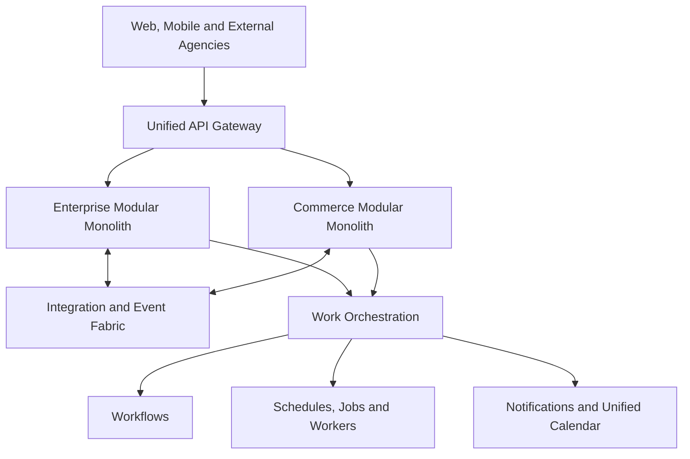
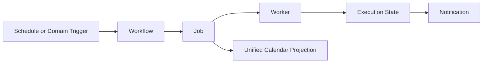

# BP-PLATFORM-001 — SKY365 Meta-Driven Dual Modular Monolith

> **Status:** Accepted product direction — implementation evidence pending  
> **Version:** 1.0  
> **Date:** 2026-07-19  
> **Owner:** WytSky Cloud Solutions Oy / SKY365  
> **Scope:** Product architecture, integration boundary, work orchestration, and Unified System Calendar V1

## Executive definition

SKY365 is not only an ERP. It is WytSky's flagship **meta-driven enterprise ecosystem**, designed as a **Dual Modular Monolith** that unifies enterprise operations, digital commerce, APIs, integrations, mobile experiences, workflow automation, jobs, notifications, and AI capabilities.

The two primary deployment and domain centers are:

1. **Enterprise Modular Monolith** — ERP, CRM, Finance, HR, Payroll, Operations, industry packs, workflows, approvals, and enterprise administration.
2. **Commerce Modular Monolith** — commerce catalog, pricing, carts, orders, marketplaces, customer experiences, and commerce providers.

Shared platform capabilities connect the two without becoming a third business monolith.

## Product architecture

## Architectural boundaries

### Enterprise Modular Monolith

Owns enterprise business domains and their transactional rules. Modules remain internally separated by explicit contracts even when deployed together.

Representative domains include:

- Finance and accounting
- HR, attendance, leave, payroll, and recruitment
- CRM, sales, service, and follow-up
- Operations and industry packs
- Approvals, cases, projects, and business workflows

### Commerce Modular Monolith

Owns digital-commerce behavior and commerce-specific transactional rules.

Representative domains include:

- Catalog and pricing
- Cart and checkout
- Orders and fulfillment
- Customer and marketplace experiences
- Commerce providers and connectors

### Shared platform layer

The shared layer provides cross-cutting capabilities but does not own domain business logic:

- Metadata and schema engine
- Identity, tenant, role, and policy controls
- Unified API Gateway
- Integration adapters, connectors, and event contracts
- Workflow and work orchestration
- Schedules, jobs, workers, retries, and execution history
- Notifications and Unified System Calendar
- Audit, metrics, observability, and operational controls
- AI agents, tools, memory, and governed actions

## Meta-driven foundation

Metadata defines configurable structures such as entities, fields, screens, validation, permissions, workflow bindings, integration mappings, and presentation rules. Metadata is a governed product capability; it must not become an unrestricted runtime shortcut around domain invariants.

The rule is:

> Metadata may configure approved behavior. Domain code still protects financial, security, compliance, and transactional invariants.

## Unified API Gateway

The gateway is the single controlled entry point for web clients, mobile applications, commerce providers, partner agencies, and external integrations.

It owns:

- Authentication and token validation
- Routing and versioning
- Tenant and policy checks
- Rate limits and request controls
- Correlation IDs, audit context, and observability
- Safe provider and integration exposure

It must not own:

- Finance, HR, commerce, or workflow business rules
- Cross-domain database joins that bypass module contracts
- A shared data model that turns the platform into a distributed monolith

## Work Orchestration model

### Canonical responsibilities

- A **workflow** models business steps, approvals, dependencies, and outcomes.
- A **schedule** defines when a command, workflow, or job becomes eligible.
- A **job** is a durable unit of work with status, ownership, priority, retries, and history.
- A **worker** claims and executes eligible jobs safely.
- A **notification** communicates user-relevant state changes.
- The **Unified System Calendar** projects user-relevant scheduled work across modules.

Not every technical job belongs on the business calendar. Backups, imports, polling, maintenance, and other background work belong in an operations/admin layer unless they affect a business deadline or require human action.

## Unified System Calendar V1

The calendar is a shared platform module, not a feature owned by HR, CRM, Finance, or Commerce.

### Required views

- Day, week, month, and agenda
- Horizontal timeline
- Resource and hierarchical layer views
- Filtered views by module, tenant, team, user, resource, job type, workflow, status, and priority
- Operational metrics and exception indicators

### Example layers

- Finance: payment dates, collection, closing, and filing deadlines
- HR: shifts, attendance, leave, payroll, interviews, and training
- CRM: calls, follow-ups, campaigns, and service commitments
- Commerce: promotions, fulfillment, delivery, and supplier actions
- Workflow: approvals, deadlines, escalations, and dependencies
- Operations: maintenance, field work, imports, and technical schedules

### Ownership rule

The source domain remains the owner of its business record. The calendar stores or reads a normalized projection containing references such as:

- Tenant and source domain
- Source entity type and identifier
- Start, end, timezone, and recurrence
- Assigned user, team, or resource
- Status, priority, visibility, and permissions
- Workflow, job, and notification references

Moving or editing a calendar item must call the owning domain contract; it must not mutate another module's tables directly.

## External calendar and meeting providers

SKY365 remains the system of record for workflows, jobs, execution history, and enterprise calendar projections.

Google and Microsoft are replaceable synchronization adapters:

- Google Calendar and Google Meet
- Microsoft Outlook Calendar and Teams
- Zoom or other meeting providers through separate adapters

Provider synchronization must support idempotency, conflict handling, audit, permission checks, token protection, retry policies, and disconnect/reconnect behavior.

## UI component policy

Radzen remains the default SKY365 UI component library. Syncfusion is used only when an already licensed component provides a material capability advantage.

For Version 1:

> **Unified System Calendar V1 uses Syncfusion Scheduler behind a SKY365-owned adapter.**

The platform must not expose Syncfusion-specific models across domain boundaries. See [ADR-PLATFORM-001](../09-decisions/ADR-PLATFORM-001-radzen-default-syncfusion-calendar-v1.md).

## Migration and implementation sequence

1. Inspect the current code, runtime, database, worker, jobs, workflow, notifications, authentication, schedules, and integration packages.
2. Build an evidence matrix: implemented, partial, duplicated, missing, or broken.
3. Define stable work-orchestration contracts before changing the calendar UI.
4. Add durable job persistence, claiming, locking, retries, idempotency, history, and failure handling where missing.
5. Normalize domain calendar projections and permissions.
6. Implement the SKY365 calendar adapter and Syncfusion Scheduler UI.
7. Connect notifications to meaningful job and workflow state transitions.
8. Add Google and Microsoft adapters only after the internal system-of-record behavior is validated.
9. Validate timezone, recurrence, concurrency, tenant isolation, large datasets, accessibility, RTL, and mobile behavior.
10. Record implementation evidence beside the affected source repositories and link it back to this blueprint.

## Explicit non-claims

This document defines the accepted target direction. It does not by itself prove that every described capability exists in production. Current implementation status must be established by repository, runtime, database, and integration evidence before migration work begins.
