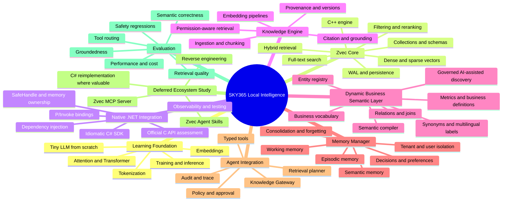

# Zvec Ecosystem, Local LLM, and SKY365 Knowledge Engine

**Status:** Active research hub  
**Visibility:** Public research and architecture only  
**Canonical repository:** `saskw2010/Sky365-knowledge-hub`  
**Visual edition:** [`index.html`](./index.html)

## Purpose

This area is the canonical public research hub for the learning and engineering journey that connects:

- building a tiny language model from first principles for understanding;
- studying and evaluating Zvec as the local retrieval and persistence engine;
- designing native .NET/C# integration while preserving the C++ performance core;
- building the SKY365 Knowledge Layer, Dynamic Business Semantic Layer, and Memory Manager;
- reviewing MCP tools and Agent Skills only when the core foundation is understood;
- integrating the resulting capabilities into the SKY365 Agent Runtime safely.

This hub does **not** copy every upstream repository into documentation. Important upstream codebases remain separate forks. This hub records why each source matters, the pinned upstream state, findings, decisions, gaps, and the canonical SKY365 direction.

## Repository strategy

### Canonical hub

`Sky365-knowledge-hub` owns:

- research notes and verified findings;
- architecture decisions and mind maps;
- reverse-engineering reports;
- comparison and gap matrices;
- source manifests and provenance;
- implementation roadmaps;
- HTML visual documentation.

### Forks

Fork a repository when all of the following are true:

1. It is strategically relevant to SKY365.
2. Code-level inspection, experiments, patches, or long-term tracking are required.
3. Upstream history and license provenance must be preserved.
4. The repository cannot be represented adequately by a link and research note.

A fork is **not** the canonical knowledge source. It is an executable research specimen and potential implementation dependency.

### Do not fork

Do not fork:

- blogs, magazines, and article sites;
- repositories that only duplicate documentation already covered by an authoritative source;
- attractive demos with no architectural relevance;
- projects that will not be tested, compared, or reused.

## Public/private boundary

The public hub may contain:

- public-source analysis;
- generic architecture;
- non-sensitive examples;
- interoperability designs;
- public benchmark methodology;
- reusable skills and tool-contract patterns.

The public hub must not contain:

- credentials, tokens, or connection strings;
- customer schemas or customer data;
- proprietary tenant vocabularies;
- production endpoints;
- internal authorization maps;
- unreleased commercial rules or sensitive competitive details.

Private implementation evidence remains in the relevant SKY365 code repositories and is linked from here without copying secrets.

## Strategic mind map



## Tracks and sequence

| Track | Scope | Current decision | Timing |
|---|---|---|---|
| A | Tiny LLM learning | Build a very small model for understanding, not competition | Now |
| B | Zvec Core inspection | Treat Zvec as storage and retrieval infrastructure, not an agent | Now |
| C | First local proof of concept | Ingest, embed, persist, search, filter, and rerank locally | Now |
| D | C++/C/.NET boundary | Preserve the C++ core and evaluate a safe C# binding layer | Next |
| E | SKY365 Knowledge Engine | Build ingestion, provenance, permissions, citations, and evaluation | Next |
| F | Dynamic Business Semantic Layer | Build a governed metadata-driven semantic control plane | Next |
| G | Memory architecture | Build memory policy and lifecycle above Zvec storage | Next |
| H | MCP tools | Reverse engineer the official Zvec MCP server and compare with SKY365 tools | Later |
| I | Agent Skills | Study the official skills format and author SKY365 equivalents | Later |
| J | Production agent integration | Connect to Shared Agent Runtime, Action Core, policy, and audit | After evaluation |

## The central architectural boundary

```text
Zvec C++ Core
    ↓
Native C/C# Integration
    ↓
SKY365 Retrieval and Persistence Adapters
    ↓
SKY365 Knowledge + Semantic + Memory Control Plane
    ↓
Knowledge Gateway + Agent Runtime + Typed Tools + Policy
```

Zvec owns efficient indexing, storage, and retrieval. SKY365 owns business meaning, memory lifecycle, authorization, tool contracts, orchestration, and safety.

## Dynamic semantic principle

The target is not an ungoverned system that guesses business meaning automatically. The target is:

> Metadata-driven, AI-assisted, human-governed dynamic business semantics.

The system may discover schemas, infer candidate relations, suggest labels, and propose mappings. Approved business definitions, permissions, metrics, and execution rules remain versioned and governed SKY365 assets.

## Source lifecycle

```text
Discover
→ Classify
→ Decide whether to fork
→ Pin upstream commit
→ Inspect code and documentation
→ Run experiments
→ Record verified capabilities
→ Build gap matrix
→ Decide reuse / wrap / rewrite / reject
→ Promote the canonical SKY365 decision
→ Track upstream changes
```

## Initial source registry

| Source | Role | Action |
|---|---|---|
| `alibaba/zvec` | Core C++ vector database | Forked as `saskw2010/zvec`; active inspection |
| `zvec-ai/zvec-mcp-server` | MCP exposure and tool contracts | Defer fork until MCP track starts |
| `zvec-ai/zvec-agent-skills` | Agent skill packaging and usage guidance | Defer fork until skills track starts |
| Karpathy tiny-GPT educational work | Learning foundation | Study and reproduce as an educational implementation |
| SKY365 repositories | Existing tools, runtime, semantic work, and policies | Inspect first; implement only missing capabilities |

## Required outputs per fork

Every strategically reviewed fork should produce:

1. Source manifest with upstream URL, license, default branch, and pinned commit.
2. Architecture anatomy.
3. Capability inventory.
4. Security and operational risks.
5. SKY365 gap matrix.
6. Reuse decision: use, wrap, port, rewrite, or reject.
7. C# opportunity assessment.
8. Experiment results.
9. HTML visual report.
10. Upstream synchronization policy.

## Immediate work package

1. Document the current Zvec Core anatomy.
2. Build a minimal local retrieval proof of concept.
3. Define the first `IKnowledgeStore` and `IRetrievalEngine` contracts.
4. Define the semantic entity and business-definition metadata model.
5. Define the memory record model without pretending that storage equals memory management.
6. Establish evaluation cases before adding MCP or Agent Skills.

## Non-negotiable decisions

- Do not place SKY365 business semantics inside the Zvec C++ engine.
- Do not answer live ERP facts from embeddings when authoritative tools exist.
- Do not copy secrets or tenant-specific schemas into this public hub.
- Do not translate upstream Python line by line into C#; recover contracts and intent, then implement idiomatic .NET components.
- Do not fork a repository merely because it is interesting.
- Every Markdown document created in this area must have an HTML visual counterpart.
