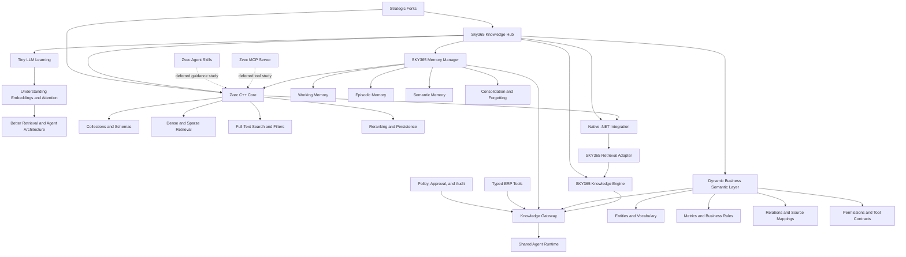

# Session Closure — Zvec, Local LLM Learning, and the SKY365 Knowledge Engine

**Status:** Published  
**Session ID:** `SESSION-TEMP`  
**Date:** 2026-07-18  
**Canonical area:** `documents/08-research/zvec-ecosystem/`  
**Scope:** Project-level extraction from the complete conversation; no raw transcript is reproduced.

---

## 1. Session Identity

| Field | Value |
|---|---|
| Session ID | `SESSION-TEMP` |
| Session Title | From Tiny GPT Learning to a Zvec-Based SKY365 Knowledge, Semantic, and Memory Architecture |
| Short Title | Zvec Local Intelligence Architecture |
| Slug | `zvec-local-llm-sky365-knowledge-engine` |
| Date | 2026-07-18 |
| Primary Project | SKY365 Local Intelligence / Knowledge Engine |
| Primary Repository | `saskw2010/Sky365-knowledge-hub` |
| Primary Code Fork | `saskw2010/zvec` |
| Related Projects | `sky365ERP`, `sky365API`, `Sky365Offers`, `all-agentic-architectures`, Shared Agent Runtime, Shared Action Core, SKY365 Semantic Layer, SKY365 Memory Manager |
| Deferred Upstream Projects | `zvec-ai/zvec-mcp-server`, `zvec-ai/zvec-agent-skills` |
| Tags | `zvec`, `llm-from-scratch`, `tiny-gpt`, `rag`, `vector-database`, `semantic-layer`, `business-semantics`, `memory`, `mcp`, `agent-skills`, `c++`, `csharp`, `dotnet`, `p-invoke`, `knowledge-engine`, `fork-strategy`, `reverse-engineering`, `sky365` |

---

## 2. Executive Summary

The session began by evaluating whether building a small GPT-style model from first principles should become part of the SKY365 learning journey. The decision was affirmative, with an explicit boundary: the model is an educational instrument for understanding tokenization, embeddings, attention, transformers, training, inference, loss, and backpropagation; it is not an attempt to compete with frontier foundation models.

The conversation then connected this learning track to the practical SKY365 architecture. Zvec was initially discussed as a possible “heart of the agent.” Direct inspection of the user’s fork, `saskw2010/zvec`, corrected that framing. Zvec Core is an in-process vector database and retrieval engine. It provides collections, scalar and vector schemas, dense and sparse vector support, full-text search, filters, hybrid or multi-route retrieval, reranking, persistence, indexes, and CRUD operations. It does not provide an agent runtime, planning loop, business ontology, dynamic business semantic layer, or memory lifecycle manager.

Two separate Zvec ecosystem repositories were identified:

- `zvec-ai/zvec-mcp-server`, which exposes Zvec operations to an external LLM through MCP tools and adds embedding helpers;
- `zvec-ai/zvec-agent-skills`, which packages documentation, examples, and instructions that help an existing coding agent build with Zvec.

Neither repository changes the core architectural conclusion. The MCP server is a tool adapter, not the agent. The skills repository is behavior and guidance content, not an agent runtime. Both are deferred until the Zvec Core learning and proof-of-concept tracks are complete.

The strategic architecture was refined into a layered system:

1. Zvec C++ Core for efficient local storage, indexing, and retrieval.
2. A native .NET integration layer, subject to verification of the safest supported C/C++ boundary.
3. SKY365 retrieval and persistence adapters.
4. SKY365 Knowledge Engine for ingestion, provenance, permission-aware retrieval, citations, versions, and evaluation.
5. A dynamic business semantic control plane for entities, relationships, metrics, multilingual vocabulary, business definitions, tool mappings, and policies.
6. A Memory Manager that owns capture, consolidation, ranking, forgetting, conflict resolution, isolation, and lifecycle while using Zvec as one possible storage and retrieval backend.
7. Knowledge Gateway, Agent Runtime, typed tools, approval, audit, and deterministic policy controls.

A repository governance strategy was also adopted. One public canonical knowledge hub records findings, decisions, source manifests, gap matrices, roadmaps, and visual documentation. Important upstream codebases remain separate forks for executable inspection and experimentation. A fork is created only when code-level study, testing, patching, reuse, or long-term upstream tracking is justified. Public documentation must not contain credentials, customer schemas, tenant vocabularies, production endpoints, authorization maps, or sensitive commercial logic.

The session produced and published the initial Zvec ecosystem research area and visual mind map, linked it from the SKY365 Master Index, and closed with a structured backlog and implementation sequence.

---

## 3. Major Topics

### 3.1 Building a Language Model from Scratch

- Use a tiny GPT implementation to understand the full learning pipeline.
- Focus on principles rather than parameter count or benchmark competition.
- Connect each learning concept to an eventual SKY365 capability.
- Treat the exercise as a foundation for better architectural judgment in embeddings, retrieval, fine-tuning, memory, and agents.

### 3.2 Zvec Core Investigation

- Verified the user’s fork: `saskw2010/zvec`.
- Compared recent commit SHAs between the fork and `alibaba/zvec`; the inspected state was synchronized.
- Inspected README and implementation files for collections, queries, schemas, field types, vector types, filtering, full-text search, reranking, and CRUD.
- Found no evidence in Zvec Core of an embedded LLM, planner, agent loop, MCP server, business semantic registry, ontology engine, or managed memory lifecycle.

### 3.3 Semantic Search versus Business Semantic Layer

- Semantic search uses embeddings or text retrieval to find similar content.
- A business semantic layer defines authoritative business meaning.
- Business definitions require governed concepts such as customer, revenue, active customer, overdue invoice, responsible employee, cancellation rules, and metric grain.
- Schema discovery and AI suggestions can accelerate creation, but business meaning cannot be accepted as an unreviewed model guess.

### 3.4 Zvec as a Memory Backend

- Zvec can persist memory records and retrieve them semantically.
- Storage does not equal memory management.
- Memory capture, importance, consolidation, conflict resolution, expiration, forgetting, privacy, and tenant isolation belong to SKY365.

### 3.5 Zvec MCP Server

- A separate repository exposes Zvec through MCP.
- It provides collection, document, query, index, and embedding-related tools.
- It depends on an external model or agent to choose and call those tools.
- It is deferred until the local Core proof of concept is complete.

### 3.6 Zvec Agent Skills

- A separate repository packages `SKILL.md`, references, examples, and usage guidance.
- Skills teach an existing agent how to use Zvec; they are not the agent runtime.
- Markdown-based skill definitions should remain portable.
- C# should implement validators, generators, adapters, and executors behind the skills rather than replacing the skill documents themselves.

### 3.7 C++ and C# Strategy

- Preserve the high-performance C++ core rather than rewriting the database engine in C#.
- Verify the supported native boundary before implementation.
- Prefer an idiomatic .NET SDK over a line-by-line Python translation.
- Candidate .NET concerns include native handles, ownership, disposal, exceptions, typed schemas, dependency injection, observability, tests, and multi-tenant safety.

### 3.8 Dynamic Business Semantics

- Adopt a metadata-driven, AI-assisted, human-governed model.
- Use a semantic registry to define entities, aliases, metrics, dimensions, relationships, filters, policies, source mappings, and tool contracts.
- Generate multiple artifacts from one governed definition where practical: C# contracts, JSON schemas, query specifications, MCP tool descriptions, Zvec metadata mappings, UI definitions, and documentation.

### 3.9 Knowledge Hub and Fork Governance

- Maintain one canonical public knowledge hub.
- Keep upstream code in separate forks.
- Do not copy all upstream content into the hub.
- Record source provenance, pinned commits, findings, experiments, gap matrices, decisions, and upstream synchronization policy.
- Classify blog and magazine content as discovery sources, not architectural authorities.

### 3.10 Documentation and Publication

- Markdown remains the structured source of truth.
- Each major document in the Zvec research area should have an HTML visual counterpart.
- The research area and mind map were linked into `MASTER-INDEX.md`.
- The current session closure is published in both Markdown and HTML form.

---

## 4. Key Decisions — Architecture Decision Records

### ADR-ZVEC-001 — Build a Tiny LLM for Understanding

- **Status:** Accepted
- **Decision:** Build a very small GPT-style model from first principles as an educational track.
- **Rationale:** Direct implementation clarifies embeddings, attention, transformer blocks, loss, backpropagation, training, and inference.
- **Constraint:** The objective is understanding, not frontier-model competition.
- **Consequence:** The learning track must produce reusable knowledge for SKY365 rather than become an isolated academic exercise.

### ADR-ZVEC-002 — Treat Zvec Core as Storage and Retrieval Infrastructure

- **Status:** Accepted
- **Decision:** Zvec Core is the local vector, text, metadata, indexing, and retrieval engine; it is not the complete agency or agent runtime.
- **Rationale:** Repository inspection showed database and query capabilities, not agent planning, tool orchestration, or business semantics.
- **Consequence:** Agent Runtime, Knowledge Gateway, tools, policies, semantics, and memory lifecycle remain separate SKY365 concerns.

### ADR-ZVEC-003 — Separate Semantic Search from Business Semantics

- **Status:** Accepted
- **Decision:** Do not label embedding similarity as the SKY365 Business Semantic Layer.
- **Rationale:** Similarity retrieval cannot define authoritative metrics, entities, joins, business rules, or operational meaning.
- **Consequence:** SKY365 must own a governed semantic registry and compiler.

### ADR-ZVEC-004 — Separate Memory Management from Memory Storage

- **Status:** Accepted
- **Decision:** Zvec may store and retrieve memories, but SKY365 owns memory policy and lifecycle.
- **Rationale:** A vector database does not decide what to remember, merge, forget, expire, isolate, or trust.
- **Consequence:** Define a dedicated Memory Manager with explicit record types, lifecycle rules, privacy, and evaluation.

### ADR-ZVEC-005 — Preserve the C++ Core and Build an Idiomatic .NET Layer

- **Status:** Accepted in principle; native boundary verification pending
- **Decision:** Do not rewrite the Zvec database engine in C#. Preserve the C++ performance core and build the safest supported .NET integration.
- **Rationale:** Rewriting the engine would create a large maintenance burden and discard its primary performance advantage.
- **Consequence:** Evaluate native APIs, ownership, disposal, errors, packaging, and cross-platform support before committing to P/Invoke or another binding method.

### ADR-ZVEC-006 — Use Metadata-Driven, AI-Assisted, Human-Governed Semantics

- **Status:** Accepted
- **Decision:** Dynamic semantics may discover and propose mappings, but approved business definitions are governed, versioned assets.
- **Rationale:** Fully autonomous semantic discovery is unreliable for company-specific meaning.
- **Consequence:** Add review, provenance, versioning, validation, tests, and rollback to semantic publication.

### ADR-ZVEC-007 — Separate Knowledge, Live Tools, Behavior, and Safety

- **Status:** Reaffirmed
- **Decision:** Use RAG for dynamic citable documents, typed tools for live operational facts and actions, skills and schemas for behavior, and deterministic policies for safety.
- **Rationale:** A single mechanism cannot provide freshness, citations, execution safety, and behavioral consistency.
- **Consequence:** Live ERP facts must not be answered from approximate embeddings when an authoritative tool exists.

### ADR-ZVEC-008 — One Canonical Public Hub, Separate Strategic Forks

- **Status:** Accepted
- **Decision:** The public `Sky365-knowledge-hub` is canonical for architecture and research; upstream code remains in separate forks.
- **Rationale:** This preserves provenance, limits duplication, and keeps executable experiments separate from approved knowledge.
- **Consequence:** Each fork must produce a source manifest, architecture anatomy, capability inventory, risk review, gap matrix, reuse decision, experiment evidence, and synchronization policy.

### ADR-ZVEC-009 — Defer MCP and Agent Skills

- **Status:** Deferred by design
- **Decision:** Do not fork or implement the Zvec MCP server and Agent Skills yet.
- **Rationale:** The team has not completed Core understanding, local proof of concept, retrieval contracts, or evaluation baselines.
- **Consequence:** MCP and skills remain registered sources for a later track.

### ADR-ZVEC-010 — Inspect First, Then Implement Only Missing Capabilities

- **Status:** Accepted
- **Decision:** Compare upstream implementations and existing SKY365 code before writing new components.
- **Rationale:** Blind translation or duplication creates technical debt and hides existing capability.
- **Consequence:** Every implementation starts with a code, runtime, schema, and behavior inventory.

### ADR-ZVEC-011 — Protect the Public/Private Boundary

- **Status:** Accepted
- **Decision:** Publish generic architecture and public-source research; keep tenant data, credentials, production mappings, and sensitive rules private.
- **Rationale:** A public knowledge hub must not become an accidental repository of customer or proprietary operational data.
- **Consequence:** Public documents reference private implementation evidence without copying secrets.

---

## 5. Knowledge Extraction

### 5.1 Concepts

- Tiny GPT and educational model construction
- Tokenization
- Embeddings
- Self-attention
- Transformer blocks
- Training loss and backpropagation
- Inference and generation
- Vector database
- In-process database
- Dense vectors
- Sparse vectors
- Full-text search
- Hybrid retrieval
- Metadata filtering
- Reranking
- Reciprocal Rank Fusion
- Weighted rank fusion
- Collection and document schemas
- Knowledge Engine
- Knowledge Gateway
- Business Semantic Layer
- Semantic registry
- Business ontology and vocabulary
- Entity and relationship mapping
- Metrics and dimensions
- Memory lifecycle
- Working, episodic, and semantic memory
- MCP tools
- Agent Skills
- Agent Runtime
- Typed tools
- Deterministic policies
- Public/private documentation boundary
- Canonical hub
- Fork governance
- Reverse engineering
- Provenance and pinned commits

### 5.2 Technologies

- Zvec Core
- C++
- Python SDK
- NumPy in the Python query path
- Dense and sparse vector indexes
- Full-text indexing
- HNSW, IVF, and Flat vector index families
- Inverted scalar indexes
- Disk-backed indexing capabilities described by the project
- RRF, weighted, callback, and custom reranking paths
- C# and .NET
- Native interoperability and P/Invoke as a candidate approach pending verification
- Markdown
- HTML
- Mermaid
- GitHub and GitHub Pages workflow already present in the hub

### 5.3 APIs

#### Zvec Core API Areas

- Create and open collections
- Collection schema definition
- Scalar and vector field definition
- Insert, upsert, update, delete, and fetch
- Vector search
- Full-text search
- Filtering
- Multi-query execution
- Reranking
- Index creation, removal, and optimization
- Grouped vector queries
- Collection statistics and persistence controls

#### Deferred MCP API Areas

- Collection management tools
- Document CRUD tools
- Vector and multi-vector query tools
- Index tools
- Embedding generation and text-to-vector helper tools

#### Proposed SKY365 Contracts

- `IKnowledgeStore`
- `IRetrievalEngine`
- `IEmbeddingProvider`
- `ISemanticRegistry`
- `ISemanticCompiler`
- `IMemoryStore`
- `IMemoryPolicy`
- `IKnowledgeGateway`
- Typed tool contracts for authoritative ERP data

### 5.4 Frameworks and Protocols

- Model Context Protocol (MCP)
- Agent Skills packaging through `SKILL.md` and supporting references
- Structured tool schemas
- Dependency injection for .NET adapters
- Policy and approval gates
- Retrieval evaluation and groundedness evaluation
- No LLM or agent framework was found as a core dependency of the inspected Zvec database package.

### 5.5 Design Patterns

- Layered architecture
- Ports and adapters
- Strategy pattern for interchangeable knowledge stores and retrievers
- Adapter pattern for Zvec and future backends
- Registry pattern for business semantics and tools
- Compiler pattern for generating runtime artifacts from governed semantic definitions
- Policy enforcement outside the probabilistic model
- Read/write separation for operational tools
- Source manifest and provenance pattern
- Canonical documentation with linked implementation evidence
- Fork-as-research-specimen pattern
- Markdown source plus HTML visual edition

### 5.6 Best Practices

- Define the architectural boundary before writing integrations.
- Preserve upstream history and licensing.
- Pin the upstream commit used for every analysis.
- Compare the fork with upstream before assuming divergence.
- Treat search indexing limitations as evidence gaps, not proof of absence.
- Inspect implementation files, dependency manifests, tests, and runtime behavior.
- Keep live business facts in authoritative tools rather than embeddings.
- Apply tenant and permission filters before data reaches the model.
- Version embeddings, chunking rules, semantic definitions, and source records.
- Build evaluation cases before adding more orchestration layers.
- Translate intent and contracts into idiomatic C# rather than porting Python line by line.
- Keep public research separate from customer and production data.

### 5.7 Lessons Learned

1. Product vocabulary can be misleading: “semantic search,” “agent skills,” and “MCP server” do not imply an integrated agent or business semantic layer.
2. Zvec is strategically valuable precisely because it is a focused storage and retrieval engine; forcing business logic into the engine would reduce maintainability.
3. Memory requires policy, lifecycle, and governance, not only vector persistence.
4. A small LLM implementation is useful when it informs product architecture; it becomes wasteful when treated as a competitor to mature foundation models.
5. Forking is useful only when it enables inspection, experimentation, patching, reuse, or upstream tracking.
6. Blog platforms such as Level Up are discovery channels, not sufficient architectural evidence.
7. Repository README claims must be validated against code, dependencies, and runtime behavior.
8. The user’s Zvec fork was synchronized with inspected upstream commits; no SKY365-specific modifications were verified in this session.
9. MCP tools and skills should be studied after the storage, retrieval, contracts, and evaluation foundation is stable.
10. Public documentation creates leverage only when provenance and confidentiality boundaries are explicit.

### 5.8 Reusable Prompts

#### Prompt A — Inspect an Upstream Fork Before Implementation

```text
Inspect the repository and its upstream before proposing implementation.

1. Confirm the fork, default branch, upstream repository, license, and current commit relationship.
2. Inventory architecture, dependencies, public APIs, persistence, tests, and runtime boundaries.
3. Search for the requested capabilities in code, not only README claims.
4. Classify each capability as implemented, partial, documentation-only, external, or absent.
5. Compare with existing SKY365 code and documentation.
6. Produce a gap matrix and a reuse decision: use, wrap, port, rewrite, or reject.
7. Do not write code until the evidence and missing capabilities are explicit.
```

#### Prompt B — Reverse Engineer a Tool Repository for C# Reimplementation

```text
Reverse engineer this tool repository at the contract level.

Extract:
- tool names and purposes;
- input and output schemas;
- validation rules;
- lifecycle and state management;
- error taxonomy;
- security assumptions;
- dependency boundaries;
- test coverage;
- protocol-specific behavior.

Then design an idiomatic .NET implementation. Do not translate source code line by line. Preserve behavior, contracts, interoperability, license obligations, and testable acceptance criteria.
```

#### Prompt C — Propose a Governed Business Semantic Definition

```text
Given the inspected ERP schema and APIs, propose a semantic definition for the requested business concept.

Include:
- canonical concept name;
- Arabic and English labels and synonyms;
- source entities and fields;
- grain and identity;
- relationships and joins;
- calculation or filter rules;
- authoritative live tool, if applicable;
- RAG eligibility;
- tenant and permission constraints;
- provenance and version;
- validation examples;
- unresolved ambiguities requiring human approval.

Do not publish the definition automatically. Mark all inferred elements as proposals.
```

#### Prompt D — Build a Local Retrieval Proof of Concept

```text
Build a minimal local retrieval proof of concept after inspecting the installed Zvec version and platform support.

The proof of concept must:
- create a collection;
- define scalar, text, and vector metadata;
- ingest a small versioned corpus;
- generate or accept local embeddings through an abstraction;
- perform vector, text, filtered, and fused retrieval where supported;
- return source identifiers and scores;
- include repeatable tests and a small evaluation set;
- record latency, memory, storage, and failure behavior;
- keep model, retriever, and embedding provider replaceable.
```

#### Prompt E — Close and Publish a Technical Session

```text
Analyze the complete session at project level. Preserve decisions, verified findings, corrections, source provenance, project status, concept relationships, backlog, TODOs, documentation changes, repository changes, commit information, and publish checks. Do not reproduce a raw transcript or invent missing identifiers. Publish Markdown and HTML editions and link them from the canonical index.
```

### 5.9 Reusable Workflows

#### Workflow 1 — Source Intake

```text
Discover
→ Classify authority and relevance
→ Decide link versus fork
→ Pin commit and license
→ Inspect code and docs
→ Run experiments
→ Record verified findings
→ Build gap matrix
→ Decide use / wrap / port / rewrite / reject
→ Promote canonical decision
→ Track upstream changes
```

#### Workflow 2 — Zvec Learning and Adoption

```text
Understand Tiny GPT fundamentals
→ Inspect Zvec Core
→ Build local retrieval proof of concept
→ Define retrieval contracts
→ Evaluate native .NET boundary
→ Build safe C# adapter
→ Add Knowledge Engine capabilities
→ Add governed semantics
→ Add memory lifecycle
→ Add MCP tools
→ Add skills
→ Integrate with Agent Runtime and policy
```

#### Workflow 3 — Semantic Definition Publication

```text
Discover source schema
→ Infer candidate concepts and relations
→ Draft semantic definition
→ Validate against authoritative data
→ Review with business owner
→ Version and approve
→ Generate contracts and mappings
→ Test queries and permissions
→ Publish
→ Monitor drift and regressions
```

#### Workflow 4 — Memory Lifecycle

```text
Capture candidate memory
→ Classify type and owner
→ Apply privacy and tenant policy
→ Score importance and confidence
→ Persist content and retrieval representation
→ Retrieve with filters
→ Consolidate duplicates
→ Resolve conflicts
→ Expire or forget
→ Audit usage
```

---

## 6. Concept Graph



### Relationships

- Tiny LLM learning informs architectural understanding but is not a production dependency.
- Zvec Core is a dependency of the proposed first retrieval implementation, not of business meaning itself.
- The .NET layer depends on verification of the supported native boundary and packaging model.
- The Knowledge Engine depends on retrieval, provenance, permissions, citations, versioning, and evaluation.
- The Business Semantic Layer depends on authoritative schemas, APIs, business ownership, and governance.
- The Memory Manager may depend on Zvec for persistence and retrieval but remains logically independent.
- The Knowledge Gateway depends on knowledge retrieval, semantic routing, authoritative tools, and policy.
- The Agent Runtime consumes these capabilities; it does not replace them.
- MCP and Agent Skills depend on stable Core and contract understanding and are therefore deferred.

### Related Projects

- `saskw2010/Sky365-knowledge-hub`
- `saskw2010/zvec`
- `saskw2010/sky365ERP`
- `saskw2010/sky365API`
- `saskw2010/Sky365Offers`
- `all-agentic-architectures` as a documented source area
- SKY365 Shared Agent Runtime
- SKY365 Shared Action Core
- SKY365 Knowledge Gateway
- SKY365 Dynamic Business Semantic Layer
- SKY365 Memory Manager

### Related Sessions

- Current session: `SESSION-TEMP`.
- No other verified session identifiers were available in this conversation. Related project documents are linked through the Knowledge Hub rather than inventing session IDs.

---

## 7. Project Analysis

| Project / Track | Status at Session Close | Decisions | TODOs | Future Work |
|---|---|---|---|---|
| Tiny LLM learning track | Approved, not yet implemented in this session | Educational model only | Select canonical implementation, dataset, environment, and lesson sequence | Connect lessons to embeddings, retrieval, and SKY365 examples |
| `saskw2010/zvec` | Fork exists; inspected state matched upstream commits checked in session | Use as Core research specimen | Add source manifest, pinned commit, architecture anatomy, build/run evidence | Track upstream and evaluate production suitability |
| Zvec Core analysis | Initial inspection completed | Database and retrieval engine, not agent | Inspect dependency manifests, C/C++ boundary, tests, build, benchmarks, failure modes | Publish full architecture anatomy and risk report |
| Local retrieval proof of concept | Not started | Required before MCP and skills | Create small corpus, embeddings abstraction, collection schema, retrieval tests, evaluation | Add permission-aware hybrid retrieval and reranking |
| Native .NET integration | Proposed, not implemented | Preserve C++ core; idiomatic .NET layer | Verify supported native API, ownership, packaging, Windows/Linux behavior | Build `Sky365.Zvec.Native` and safe SDK only after evidence |
| SKY365 Knowledge Engine | Architecture direction documented, implementation not verified here | Own ingestion, provenance, permissions, citations, versions, evaluation | Define interfaces and first record schema | Integrate with source connectors and Agent Runtime |
| Dynamic Business Semantic Layer | Accepted architecture, not implemented here | Metadata-driven, AI-assisted, human-governed | Define entity, metric, relation, synonym, policy, and source mapping model | Build semantic compiler, approval UI, regression tests |
| SKY365 Memory Manager | Concept accepted, not implemented here | Lifecycle separate from vector storage | Define memory types, capture, ranking, consolidation, forgetting, isolation | Add memory evaluation and policy controls |
| `zvec-ai/zvec-mcp-server` | Identified and inspected at README level; not forked | Defer | Register source and future reverse-engineering checklist | Compare tools with existing SKY365 tool registry; port valuable contracts to C# |
| `zvec-ai/zvec-agent-skills` | Identified and inspected at README level; not forked | Defer | Register source and future skill anatomy checklist | Author SKY365 Zvec, semantic, memory, and safe-tool skills |
| Public Zvec research hub | Created and indexed | Canonical architecture and findings live here | Maintain source manifests, session records, and visual editions | Publish experiments, ADRs, gap matrices, and roadmap |
| Existing SKY365 code repositories | Related but not comprehensively inspected in this session | Check first, implement missing only | Inventory tool, semantic, memory, runtime, and policy capabilities | Build implementation evidence map and avoid duplication |

---

## 8. Discussion Backlog

1. Which exact Zvec version and commit should become the first pinned experimental baseline?
2. What is the verified native integration surface for .NET on Windows and Linux?
3. Should the first proof of concept use Python to validate behavior before the C# adapter, or start at the native boundary?
4. Which local embedding model fits the existing workstation and Arabic/English business text requirements?
5. What corpus should represent the first reproducible evaluation set?
6. Which retrieval modes are required for the first milestone: vector, FTS, sparse, filtered, fused, and reranked?
7. How will tenant and permission filters be enforced before retrieval results reach the model?
8. What is the canonical SKY365 knowledge record schema?
9. What is the first semantic definition format: YAML, JSON, C#, database metadata, or a compiled combination?
10. How will semantic definitions generate typed tools, query specifications, UI metadata, and Zvec mappings?
11. Which business concepts form the minimum semantic vertical slice?
12. How will live ERP facts be routed to typed tools while documents route to RAG?
13. What memory types are allowed, and who owns each type?
14. What are the retention, conflict, confidence, and forgetting rules?
15. What metrics will establish retrieval quality, groundedness, semantic correctness, latency, and memory usefulness?
16. Which existing SKY365 tools duplicate the official Zvec MCP tools?
17. When the MCP track begins, should the server be wrapped, ported, or redesigned around SKY365 contracts?
18. What should a SKY365 Agent Skill standard contain beyond upstream Zvec documentation?
19. How will public research remain useful without exposing private schemas or commercial logic?
20. What is the upstream synchronization and divergence policy for `saskw2010/zvec`?

---

## 9. TODO List

### Immediate

- [ ] Create a source manifest for `saskw2010/zvec` with upstream URL, license, branch, and pinned commit.
- [ ] Publish a Zvec Core architecture anatomy based on code, dependencies, tests, and build files.
- [ ] Define the first local retrieval proof-of-concept acceptance criteria.
- [ ] Select a small public, non-sensitive bilingual corpus.
- [ ] Define a replaceable embedding provider contract.
- [ ] Create a small retrieval evaluation dataset before implementation.
- [x] Publish the canonical research hub and mind map.
- [x] Link the research hub from `MASTER-INDEX.md`.
- [x] Publish this complete session closure.

### Short-Term

- [ ] Run Zvec locally on the target Windows environment.
- [ ] Validate collection creation, persistence, CRUD, vector retrieval, filters, FTS, and reranking.
- [ ] Measure latency, memory, disk usage, and failure recovery.
- [ ] Define `IKnowledgeStore` and `IRetrievalEngine`.
- [ ] Verify the supported native C/C++ interface and cross-platform packaging.
- [ ] Draft the safe .NET ownership and disposal model.
- [ ] Inventory existing SKY365 retrieval, semantic, memory, MCP, and tool code.
- [ ] Produce the first implementation gap matrix.

### Long-Term

- [ ] Build the SKY365 Knowledge Engine.
- [ ] Build the Dynamic Business Semantic Layer and compiler.
- [ ] Build the Memory Manager and lifecycle policies.
- [ ] Integrate Knowledge Gateway routing with the Shared Agent Runtime.
- [ ] Connect typed tools, approval gates, policies, and audit.
- [ ] Add production evaluation dashboards and regression datasets.
- [ ] Establish backend replacement tests to prevent Zvec lock-in.

### Research

- [ ] Evaluate Arabic and English embedding models for local use.
- [ ] Compare dense, sparse, FTS, and fused retrieval on representative business queries.
- [ ] Evaluate reranking options and cost/latency tradeoffs.
- [ ] Study native API stability and version compatibility.
- [ ] Compare metadata-driven semantic systems such as MetricFlow and Cube at the design-pattern level.
- [ ] Research semantic drift detection and governed AI-assisted schema discovery.
- [ ] Study memory consolidation, conflict resolution, and forgetting evaluation.
- [ ] Reverse engineer `zvec-ai/zvec-mcp-server` only when the MCP track starts.
- [ ] Reverse engineer `zvec-ai/zvec-agent-skills` only when the skills track starts.

### Documentation

- [ ] Add `SOURCE-MANIFEST.md` for Zvec.
- [ ] Add `ZVEC-CORE-ANATOMY.md` and HTML edition.
- [ ] Add `ZVEC-POC-SPEC.md` and HTML edition.
- [ ] Add `ZVEC-DOTNET-INTEROP-DECISION.md` and HTML edition after verification.
- [ ] Add `SEMANTIC-MODEL-SPEC.md` and HTML edition.
- [ ] Add `MEMORY-LIFECYCLE-SPEC.md` and HTML edition.
- [ ] Add `ZVEC-MCP-GAP-MATRIX.md` when the MCP track starts.
- [ ] Add `ZVEC-SKILLS-ANATOMY.md` when the skills track starts.
- [ ] Maintain links from the local research README and `MASTER-INDEX.md`.

---

## 10. Documentation Updates

### Published During the Session

- `documents/08-research/zvec-ecosystem/README.md`
  - Established the canonical public research area.
  - Defined the repository and fork strategy.
  - Added the strategic mind map, tracks, source lifecycle, source registry, required fork outputs, immediate work package, and non-negotiable decisions.

- `documents/08-research/zvec-ecosystem/index.html`
  - Published the visual mind map and track sequencing.
  - Visualized the C++ → .NET → Knowledge/Semantic/Memory → Agent Runtime boundary.
  - Documented fork decisions and the public/private boundary.

- `MASTER-INDEX.md`
  - Added links to the Zvec research source and visual mind map.
  - Recorded the approved sequence: Tiny LLM and Zvec Core first; .NET, Knowledge, Semantics, and Memory next; MCP and skills later.

### Published at Session Close

- `documents/08-research/zvec-ecosystem/sessions/2026-07-18-session-close.md`
  - Full project-level session closure.

- `documents/08-research/zvec-ecosystem/sessions/2026-07-18-session-close.html`
  - Visual publication edition of the session closure.

### Index Updates at Session Close

- The Zvec ecosystem README is updated with a session records section.
- The Master Index is updated with the current session closure links.

---

## 11. Repository Changes

### New Files

1. `documents/08-research/zvec-ecosystem/README.md`
2. `documents/08-research/zvec-ecosystem/index.html`
3. `documents/08-research/zvec-ecosystem/sessions/2026-07-18-session-close.md`
4. `documents/08-research/zvec-ecosystem/sessions/2026-07-18-session-close.html`

### Updated Files

1. `MASTER-INDEX.md`
   - Linked the Zvec ecosystem research area.
   - Linked the current session closure.

2. `documents/08-research/zvec-ecosystem/README.md`
   - Added the session records section and closure links.

### Deprecated Files

- None.

### External Repository State

- `saskw2010/zvec` existed before the documentation publication and was inspected.
- No code changes to `saskw2010/zvec` were made in this session.
- No fork was created for the MCP server or Agent Skills in this session.

---

## 12. Commit Message

### Title

```text
docs: close Zvec local intelligence architecture session
```

### Description

```text
Publish the full project-level session closure covering:

- Tiny LLM learning goals and boundaries;
- verified Zvec Core capabilities and non-capabilities;
- semantic search versus business semantics;
- memory storage versus memory lifecycle;
- C++ core and proposed idiomatic .NET integration;
- Knowledge Engine, Semantic Layer, and Memory architecture;
- MCP and Agent Skills deferral;
- public hub and strategic fork governance;
- ADRs, concept graph, project status, backlog, TODOs, repository changes, and publish checks;
- Markdown and HTML editions linked from the canonical indexes.
```

---

## 13. Publish Checklist

### Content Integrity

- [x] Entire conversation analyzed at project level.
- [x] Latest discussion was not treated as the whole session.
- [x] No raw transcript was invented or reproduced.
- [x] Verified findings are separated from proposals and future work.
- [x] Corrections to earlier assumptions are preserved.
- [x] Architecture decisions are recorded as ADRs.
- [x] Concept graph and dependencies are included.
- [x] Reusable prompts and workflows are extracted.

### Repository Integrity

- [x] Canonical repository identified.
- [x] Primary fork identified.
- [x] Deferred upstream repositories identified without creating premature forks.
- [x] New Markdown closure created.
- [x] HTML visual edition created.
- [x] Zvec research README linked to the session record.
- [x] Master Index linked to the session record.
- [x] No files deprecated.

### Security and Governance

- [x] No credentials or tokens included.
- [x] No customer data included.
- [x] No tenant-specific schema included.
- [x] No production endpoint or authorization map included.
- [x] Public and private boundaries preserved.
- [x] Upstream code and canonical documentation roles remain separate.

### Implementation Readiness

- [x] Immediate work package defined.
- [x] Short-term and long-term work separated.
- [x] Research backlog preserved.
- [x] Documentation backlog preserved.
- [ ] Zvec Core source manifest completed.
- [ ] Local proof of concept executed.
- [ ] Native .NET boundary verified.
- [ ] Semantic model implemented.
- [ ] Memory lifecycle implemented.
- [ ] MCP and Agent Skills reverse engineering started.

---

## Closure Statement

This session is closed as an architecture and research milestone. The approved next move is not to add more ecosystem components. It is to convert the current understanding into evidence: pin the Zvec baseline, document the Core, build and evaluate the smallest local retrieval proof of concept, and inspect existing SKY365 implementation before creating new C# components.
