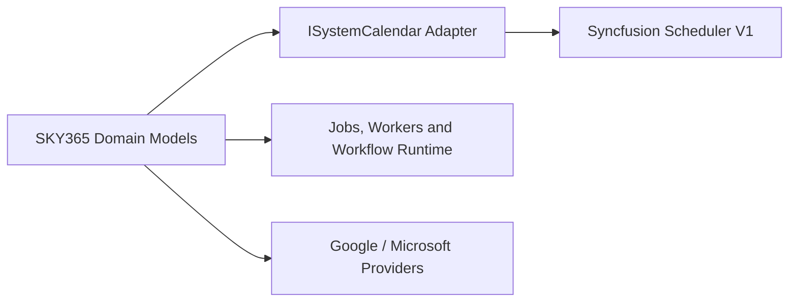

# ADR-PLATFORM-001 — Radzen by Default; Syncfusion Scheduler for Unified Calendar V1

- **Status:** Accepted
- **Date:** 2026-07-19
- **Decision owners:** WytSky Cloud Solutions Oy / SKY365
- **Related blueprint:** [BP-PLATFORM-001](../07-blueprints/BP-PLATFORM-001-sky365-meta-driven-dual-modular-monolith.md)

## Context

SKY365 uses Blazor-oriented UI components and must control long-term licensing, upgrade cost, vendor coupling, and replacement risk. Radzen and Syncfusion both provide calendar-related components, but the Unified System Calendar requires advanced resource grouping, hierarchical layers, timelines, recurrence, timezone handling, enterprise customization, and future external-calendar synchronization.

WytSky has a purchased Syncfusion license. That license does not justify making Syncfusion the default for every screen. The product should use the simplest adequately capable licensed dependency.

## Decision

1. **Radzen is the default UI component library for SKY365.**
2. A Syncfusion component may be used only when:
   - it provides a material capability advantage;
   - the requirement exists in the approved product scope;
   - the exact package, version, developers, deployment, and use are covered by WytSky's license;
   - a SKY365-owned adapter or wrapper prevents unnecessary vendor leakage.
3. **Unified System Calendar V1 will use Syncfusion Scheduler.**
4. The job engine, worker runtime, workflow engine, notification engine, calendar contracts, permissions, and domain projections remain owned by SKY365.
5. No trial, evaluation-only, unlicensed, or license-ambiguous package may enter a production build.
6. Package versions must be pinned. Upgrades require license and regression review, not automatic dependency updates.

## Implementation boundary



Domain modules depend on SKY365 calendar contracts. They do not depend directly on Syncfusion event models.

Recommended internal boundary:

```text
Sky365.UnifiedCalendar
├── Application
├── Contracts
├── DomainProjections
├── Providers
│   ├── Google
│   └── Microsoft
└── UI
    └── SyncfusionCalendarAdapter
```

The final folder and project placement must follow inspection of the actual repository structure. The outline above is a responsibility map, not authorization to invent a parallel architecture.

## Why Syncfusion for Calendar V1

The calendar requires a stronger built-in foundation for resource scheduling, grouping, hierarchical and timeline views, recurrence, timezones, drag/resize interactions, and advanced templates. Rebuilding these capabilities over a simpler calendar would shift cost from licensing to custom code, testing, accessibility, and maintenance.

## Consequences

### Positive

- Faster delivery of the enterprise calendar experience.
- Radzen remains the low-lock-in default for ordinary UI.
- Vendor dependency is isolated behind a replaceable boundary.
- Jobs and workflows remain independent from the visual calendar component.

### Costs and risks

- Syncfusion license entitlement and renewal/upgrade conditions must be tracked.
- The adapter requires explicit mapping and regression tests.
- Advanced UI features may tempt teams to move domain logic into component event handlers.
- Mixing component libraries can produce inconsistent styling unless SKY365 design tokens govern both.

## Rejected alternatives

### Use Syncfusion for the entire product

Rejected because superior capability in one area does not justify broader commercial dependency and upgrade exposure.

### Use Radzen Scheduler and custom-build all missing advanced behavior

Rejected for V1 because the required calendar depth would create avoidable delivery and maintenance risk.

### Make Google or Microsoft Calendar the system of record

Rejected because workflows, jobs, permissions, audit, and tenant data must remain under SKY365 control.

### Couple jobs directly to calendar events

Rejected because many jobs are technical or invisible to end users, and a calendar event is not a durable execution model.

## Required controls

- Maintain a dependency and license register with package, version, owner, entitlement, renewal date, and approved use.
- Pin NuGet versions.
- Test upgrade candidates in a separate branch.
- Add contract tests for mapping between SKY365 entries and Syncfusion events.
- Add visual tests for RTL, accessibility, mobile, timeline, resources, recurrence, and high event density.
- Keep technical jobs in an operations layer unless they require user action.
- Review the decision if Radzen reaches functional parity, license terms change, or calendar requirements change materially.
