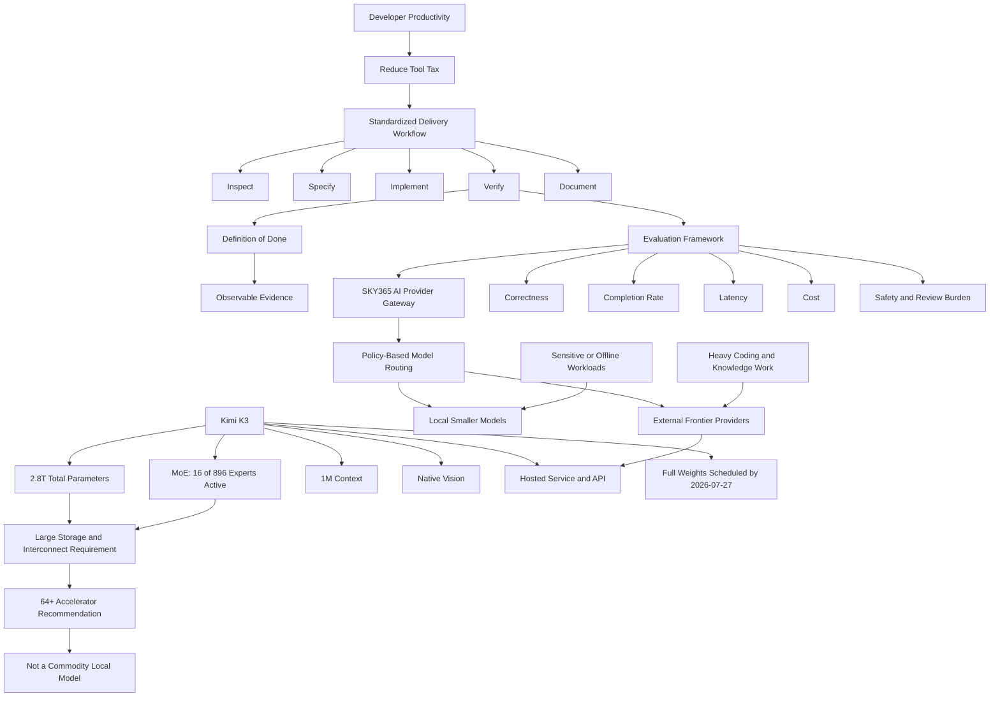

# SESSION-TEMP — Developer Productivity Habits and Kimi K3 Deployment Reality

> Publishing status: Published to the SKY365 Knowledge Hub on `main`.
>
> Session scope: The complete current conversation, beginning with the developer-productivity article and continuing through the Kimi K3 article review and the final close/publish/commit instruction. No raw transcript is reconstructed or fabricated.

## 1. Session Identity

| Field | Value |
|---|---|
| Session ID | `SESSION-TEMP` — a permanent sequential ID was not verifiably available during closure |
| Session Title | Developer Productivity Habits and Kimi K3 Deployment Reality |
| Short Title | Productivity + Kimi K3 |
| Slug | `developer-productivity-kimi-k3-analysis` |
| Date | 2026-07-18, Asia/Kuwait |
| Primary Project | SKY365 Knowledge Hub |
| Related Projects | SKY365 Agentic Platform; SKY365 AI Provider Gateway; SKY365 Private/On-Prem AI; SKY365 Developer Workflow; Zvec/Local Intelligence Research |
| Tags | `developer-productivity`, `developer-experience`, `tool-tax`, `check-first`, `definition-of-done`, `kimi-k3`, `open-weight-models`, `local-llm`, `model-routing`, `provider-abstraction`, `agentic-coding`, `benchmarking` |

### Source material

1. [10 Productivity Habits That Make Me Faster Than Most Devs I Work With](https://levelup.gitconnected.com/10-productivity-habits-that-make-me-faster-than-most-devs-i-work-with-d4494c730011), Andrus, 2026-06-29.
2. [The World’s Largest Open Model Just Dropped. You Still Can’t Run It.](https://medium.com/@lenner9090/the-worlds-largest-open-model-just-dropped-you-still-can-t-run-it-473cbc72a9ca), Andrus, accessed 2026-07-18.
3. [Kimi K3: Open Frontier Intelligence](https://www.kimi.com/fr-fr/blog/kimi-k3), official Kimi release source, accessed 2026-07-18.
4. [Kimi API Platform](https://platform.kimi.com/), official service and pricing source, accessed 2026-07-18.
5. [Moonshot AI on Hugging Face](https://huggingface.co/moonshotai), official model publisher profile, accessed 2026-07-18.

## 2. Executive Summary

The session reviewed two member-only articles by the same author and converted their useful claims into SKY365 operating decisions.

The first article presents developer productivity as the removal of repeated micro-friction rather than the accumulation of tools. Only the introduction and the first habit, **“Stop letting your tools tax you,”** were publicly visible. The remaining nine habits were not reconstructed. The reusable insight is that developer speed comes from eliminating recurring decisions, reducing context switching, standardizing project operations, and finishing a verifiable delivery cycle. For SKY365, this reinforces the existing **Check first, then implement** rule and extends it into a five-stage delivery workflow: **Inspect → Specify → Implement → Verify → Document**.

The second article argues that Kimi K3 can be open while remaining impossible for ordinary local hardware to run. The core argument is directionally correct, but the article title compresses two different events. As of 2026-07-18, Kimi K3 was available through Kimi, Kimi Work, Kimi Code, and the Kimi API, while the official release stated that full weights would be released by 2026-07-27. Therefore, the service had launched, but the complete weight publication had not yet occurred.

Officially stated Kimi K3 characteristics include 2.8 trillion total parameters, native vision, a one-million-token context window, Kimi Delta Attention, Attention Residuals, and a Stable LatentMoE configuration activating 16 of 896 experts. Moonshot recommends deployment on supernodes with at least 64 accelerators. Approximate weight storage alone is about 1.4 TB at four bits or 700 GB at two bits, before runtime buffers, activations, KV cache, routing metadata, and distributed-serving overhead. This excludes Kimi K3 as a practical local model for the known SKY365 workstation baseline and from the default SKY365 Private/On-Prem offering.

The accepted project direction is to treat Kimi K3 as an optional external frontier provider behind the SKY365 AI Provider Gateway. Smaller local models remain responsible for private, low-latency, offline, and routine workloads. Kimi K3 may be evaluated for long-horizon coding, repository analysis, deep research, multimodal engineering, and high-complexity knowledge work. Adoption must depend on normalized benchmarks, data-handling controls, cost, latency, completion rate, and correctness—not parameter count or vendor benchmark headlines.

## 3. Major Topics

### 3.1 Evidence-limited article review

Both articles are member-only. The session established that inaccessible content must not be inferred from a title, teaser, or author style. Publicly visible claims may be summarized; inaccessible sections must be labeled as unavailable.

### 3.2 Developer productivity as friction removal

The useful productivity thesis is not “work faster at all costs.” It is to remove repeated operational friction:

- one reliable way to start, test, inspect, and debug a project;
- fewer tool transitions and duplicated interfaces;
- reusable templates for specifications, tests, pull requests, and documentation;
- explicit acceptance criteria and non-goals;
- a verifiable Definition of Done.

The critical distinction is between **coding throughput** and **delivered value**. Faster code generation can increase unfinished work, defects, review load, and architectural drift when the verification and closure stages are weak.

### 3.3 Check-first delivery lifecycle

The session translated the productivity lesson into a reusable SKY365 workflow:

`Inspect → Specify → Implement → Verify → Document`

This workflow applies to human developers and AI agents. It prevents agents from rebuilding existing capabilities, inventing schemas, bypassing runtime evidence, or declaring success after code generation without proof.

### 3.4 Open weights versus local runnability

“Open” does not imply “laptop-runnable.” Total parameters still determine weight storage and distribution requirements even when Mixture-of-Experts inference activates only a subset of experts per token. MoE reduces active computation; it does not make the inactive weights disappear from the serving system.

### 3.5 Kimi K3 deployment reality

Kimi K3 is relevant to SKY365 as a hosted frontier model, not as the default local runtime. Its official release recommends 64 or more accelerators and documents model-specific serving and harness constraints.

### 3.6 Provider abstraction and hybrid routing

SKY365 should avoid hard-coupling workflows to a single vendor. A provider gateway must support policy-based routing among:

- local/private models for sensitive and routine operations;
- external frontier models for high-complexity tasks;
- deterministic tools and policies for operational truth and safety.

### 3.7 Benchmark skepticism

Vendor benchmark tables may combine different reasoning settings, harnesses, context strategies, budgets, and fallback behavior. They are evidence of capability, not a neutral procurement decision. SKY365 requires reproducible evaluations under a shared task set and explicit resource budgets.

## 4. Key Decisions — Architecture Decision Records

### ADR-SESSION-TEMP-001 — Evidence-first review of restricted articles

- **Status:** Accepted
- **Context:** The two source articles expose only partial text without membership access.
- **Decision:** Extract only visible claims, verify material technical facts against official or primary sources, and explicitly mark inaccessible sections. Do not reconstruct missing habits or arguments.
- **Consequences:** Reviews may be less comprehensive, but provenance and trustworthiness are preserved. Follow-up review requires legitimate access to the full article.

### ADR-SESSION-TEMP-002 — Standardize the SKY365 delivery lifecycle

- **Status:** Accepted as operating guidance; implementation templates remain pending.
- **Context:** Tool friction and repeated micro-decisions reduce delivery speed, while AI-generated code can create false completion signals.
- **Decision:** Standardize the lifecycle as **Inspect → Specify → Implement → Verify → Document**. Require runtime, database, API, test, and UI evidence where applicable.
- **Consequences:** Initial implementation may feel slower, but rework, duplicate development, and unverifiable completion should decrease.

### ADR-SESSION-TEMP-003 — Integrate Kimi K3 only through provider abstraction

- **Status:** Accepted
- **Context:** Kimi K3 is available as a service and API, but it is too large for ordinary local deployment and its full weights were not yet released as of the session date.
- **Decision:** Any Kimi K3 experiment must use the SKY365 AI Provider Gateway or an equivalent adapter boundary. Business workflows must not call Kimi-specific APIs directly.
- **Consequences:** SKY365 retains portability, can compare providers, and can replace or disable Kimi without rewriting domain workflows.

### ADR-SESSION-TEMP-004 — Exclude Kimi K3 from the default Private/On-Prem baseline

- **Status:** Accepted
- **Context:** The official recommendation is a supernode with at least 64 accelerators. Approximate quantized weight storage remains hundreds of gigabytes to terabytes before serving overhead.
- **Decision:** Use smaller and medium local models for SKY365 Private/On-Prem. Treat Kimi K3 as an optional external provider for approved workloads only.
- **Consequences:** The private edition remains deployable on realistic customer infrastructure. Kimi K3 features require explicit network, privacy, budget, and policy approval.

### ADR-SESSION-TEMP-005 — Normalize model evaluation before adoption

- **Status:** Accepted
- **Context:** Official Kimi K3 results use maximum reasoning effort and multiple agent harnesses, and some comparisons rely on different fallback or context-management behavior.
- **Decision:** Evaluate models using the same task corpus, acceptance tests, tool permissions, time limits, token budgets, cost accounting, and scoring rubric. Track correctness, completion rate, latency, cost, safety violations, and human-review burden.
- **Consequences:** Headline benchmark rankings are not sufficient for provider selection. Evaluation infrastructure becomes a prerequisite for production routing.

## 5. Knowledge Extraction

### 5.1 Concepts

- **Tool tax:** Repeated cognitive and operational cost imposed by fragmented or poorly standardized tools.
- **Productivity theater:** Practices that look organized or advanced but do not improve delivery outcomes.
- **Context switching:** Attention loss caused by moving among tools, projects, interfaces, or problem frames.
- **Definition of Done:** Explicit evidence required before work is considered complete.
- **Open-weight model:** A model whose weights are intended to be available under stated terms; this does not guarantee immediate publication, permissive licensing, or commodity hardware compatibility.
- **Total versus active parameters:** Total parameters determine stored model size; active parameters approximate the subset used during a token computation in sparse MoE models.
- **Distributed inference:** Serving a model across multiple accelerators and communication domains.
- **Provider abstraction:** An adapter boundary that isolates applications from vendor-specific APIs and model behavior.
- **Policy-based model routing:** Selecting a model based on sensitivity, capability, cost, latency, availability, and governance rules.
- **Evidence-first adoption:** Requiring official specifications, independent tests, and project-specific evaluation before architectural commitment.

### 5.2 Technologies

- Kimi K3
- Kimi Code
- Kimi Work
- Kimi API
- Kimi Delta Attention (KDA)
- Attention Residuals (AttnRes)
- Stable LatentMoE
- MXFP4 weights and MXFP8 activations
- vLLM integration for KDA-related serving support
- Mooncake disaggregated inference architecture
- Local LLM runtimes and smaller quantized models

### 5.3 APIs

- **Kimi API:** Hosted model access; the official Kimi developer platform describes OpenAI-compatible integration patterns.
- **Model identifier:** `kimi-k3` on the official platform at the time of review.
- **Pricing at review time:** USD 0.30 per million cache-hit input tokens, USD 3.00 per million cache-miss input tokens, and USD 15.00 per million output tokens.
- **Context caching:** Important for repeated repository/system context and cost control.

All prices and availability are time-sensitive and must be rechecked before production use.

### 5.4 Frameworks

- Inspect–Specify–Implement–Verify–Document lifecycle
- Definition-of-Done evidence framework
- Provider evaluation scorecard
- Agent harnesses such as Kimi Code, Claude Code, and Codex
- `AGENTS.md` as an explicit behavioral and boundary contract for coding agents

### 5.5 Design Patterns

- Adapter / Provider pattern
- Strategy pattern for model selection
- Policy-based routing
- Local-first processing for sensitive information
- External escalation for high-complexity tasks
- Small vertical-slice delivery
- Evidence ledger for implementation verification
- Separation of probabilistic reasoning from deterministic tools and policies

### 5.6 Best Practices

1. Inspect code, runtime, database, routes, and logs before proposing changes.
2. Write acceptance criteria and non-goals before implementation.
3. Implement the smallest end-to-end slice that proves the architecture.
4. Verify with tests and observable evidence, not generated-code volume.
5. Document behavior, limitations, and operational steps immediately after verification.
6. Route sensitive data locally unless an approved external-data policy permits otherwise.
7. Recheck model availability, pricing, licensing, and data terms at adoption time.
8. Compare models under identical harnesses and budgets.
9. Treat vendor benchmark claims as hypotheses to test.
10. Preserve an exit path from every external AI provider.

### 5.7 Lessons Learned

- The most valuable productivity improvements often remove decisions rather than add tools.
- Faster generation without verification can increase total project latency.
- A sparse MoE model may have modest active computation while retaining enormous storage and interconnect requirements.
- “Open” has several dimensions: announced openness, weight availability, license terms, tooling maturity, and practical runnability.
- A model can be strategically useful through an API even when it is impossible to self-host.
- Model size is not an architecture decision; workload fit, data boundaries, cost, and evaluation evidence are.
- Paywalled or inaccessible content is a knowledge boundary, not permission to fill gaps with plausible text.

### 5.8 Reusable Prompts

#### Technical article verification

```text
Review [URL] as an evidence-first technical analyst.
Separate:
1. directly visible claims,
2. author opinion,
3. claims verified by official or primary sources,
4. inaccessible or paywalled sections,
5. marketing exaggeration or ambiguity,
6. implications for SKY365,
7. adopt / experiment / reject decisions.
Never infer or reconstruct inaccessible content.
```

#### Model adoption gate

```text
Assess [MODEL] for local, private/on-prem, and hosted API use.
Verify total and active parameters, precision and memory requirements,
runtime topology, context length, weight availability, license, official pricing,
data handling, supported tools, serving frameworks, and benchmark methodology.
Produce risks, required controls, a normalized evaluation plan, and an
Adopt / Experiment / Reject decision for each deployment mode.
```

#### Agent implementation closure

```text
Check first, then implement.
Inspect the existing code, runtime, database, routes, configuration, and logs.
Define acceptance criteria and non-goals.
Implement the smallest complete vertical slice.
Verify it with tests, screenshots, API traces, database evidence, and runtime logs as applicable.
Update the architecture and operational documentation.
Do not declare completion without observable evidence.
```

### 5.9 Reusable Workflows

#### Workflow A — Evidence-first article review

1. Open the original article.
2. Determine access limitations.
3. Extract only visible claims.
4. Identify material claims requiring verification.
5. Prefer official and primary sources.
6. Separate facts, calculations, opinions, and inferences.
7. Map verified findings to project decisions.
8. Record unresolved questions and review dates.

#### Workflow B — Developer delivery closure

1. Inspect the current implementation and evidence.
2. Specify acceptance criteria and non-goals.
3. Implement a small end-to-end slice.
4. Verify functional, data, UI, security, and regression behavior.
5. Document the result and remaining risks.
6. Close only when the Definition of Done is satisfied.

#### Workflow C — Hybrid model routing

1. Classify data sensitivity and task complexity.
2. Use deterministic tools for live operational truth.
3. Route routine or sensitive work to local models.
4. Escalate approved high-complexity work to an external frontier model.
5. Apply redaction, policy, budget, and approval controls.
6. Log provider, model, cost, latency, evidence, and outcome.
7. Fall back to another provider or local workflow when constraints fail.

## 6. Concept Graph



### Relationships

| Source | Relationship | Target |
|---|---|---|
| Tool tax | reduced by | standardized workflow |
| Standardized workflow | terminates in | evidence-backed Definition of Done |
| Kimi K3 total model size | requires | distributed storage and high-bandwidth interconnect |
| MoE activation sparsity | reduces | active token computation |
| MoE activation sparsity | does not eliminate | total weight storage |
| SKY365 AI Provider Gateway | isolates | domain workflows from model vendors |
| Data sensitivity | constrains | provider selection |
| Task complexity | influences | local versus external routing |
| Evaluation evidence | governs | adoption and routing policy |

### Dependencies

- Kimi K3 production use depends on provider-adapter implementation, security review, data-handling approval, budget controls, and normalized evaluation.
- Private/On-Prem AI depends on a maintained catalog of realistically deployable local models.
- The delivery workflow depends on project-specific inspection commands, acceptance templates, evidence capture, and documentation ownership.
- A permanent session ID depends on a verifiable session registry or allocation mechanism.

### Related Projects

- SKY365 Knowledge Hub
- SKY365 Agentic Platform
- SKY365 AI Provider Gateway
- SKY365 Private/On-Prem AI
- SKY365 Developer Workflow
- Zvec Ecosystem and Local Intelligence Research

### Related Sessions

No related session ID was verifiably available. Related repository governance documents are:

- [`docs/SESSION_CLOSE_PROTOCOL.md`](../../../../../docs/SESSION_CLOSE_PROTOCOL.md)
- [`MASTER-INDEX.md`](../../../../../MASTER-INDEX.md)
- [`documents/08-research/zvec-ecosystem/README.md`](../../../08-research/zvec-ecosystem/README.md)

## 7. Project Analysis

| Project | Status | Decisions | TODOs | Future Work |
|---|---|---|---|---|
| SKY365 Knowledge Hub | Active; this session is published | Preserve evidence, decisions, concept links, and project history | Allocate permanent session ID; maintain session index | Automate session registration and cross-link validation |
| SKY365 Developer Workflow | Direction accepted; templates not yet implemented | Use Inspect → Specify → Implement → Verify → Document | Create checklists, Definition-of-Done templates, and evidence conventions | Integrate into agent instructions, CI, and review gates |
| SKY365 AI Provider Gateway | Architecture direction accepted; Kimi adapter not evidenced as implemented | Kimi K3 must remain behind provider abstraction | Define provider contract and Kimi proof of concept | Add policy routing, telemetry, fallback, and cost governance |
| SKY365 Private/On-Prem AI | Active strategic track | Do not use Kimi K3 as the baseline local model | Maintain deployable local-model matrix | Build tiered customer hardware profiles and upgrade paths |
| SKY365 Agent Evaluation | Planned | Normalize harness, budget, tools, and scoring | Build a representative task suite | Continuous provider regression testing and routing optimization |
| Zvec/Local Intelligence Research | Related; unchanged in this session | Continue local knowledge-engine research independently of frontier API hype | Cross-link local-model routing criteria | Evaluate retrieval, memory, and semantic-layer combinations |

## 8. Discussion Backlog

1. Obtain legitimate access to the full productivity article before evaluating all ten habits.
2. Define a measurable productivity score that does not reward code volume or premature ticket closure.
3. Determine the Kimi API data-retention, residency, training-use, and enterprise-isolation terms applicable to SKY365 customers.
4. Reassess Kimi K3 after the scheduled 2026-07-27 weight and technical-report release.
5. Verify the final Kimi K3 license and whether practical third-party quantizations or serving recipes emerge.
6. Compare Kimi K3 with current OpenAI, Anthropic, GLM, and deployable local models on identical SKY365 tasks.
7. Test whether a one-million-token context is economically superior to retrieval, repository maps, and context compaction for SKY365 workloads.
8. Define guardrails for Kimi K3’s documented excessive proactiveness.
9. Validate harness compatibility and session-history requirements before using Kimi K3 in long-running agents.
10. Establish when external frontier escalation produces enough quality gain to justify privacy, latency, and cost trade-offs.

## 9. TODO List

### Immediate

- [x] Analyze the entire current conversation.
- [x] Publish this structured session record.
- [x] Link the session from the master index.
- [ ] Allocate a permanent sequential session ID and rename the file without losing history.
- [ ] Decide whether the embedded ADRs should be promoted into canonical files under `documents/09-decisions/`.

### Short-Term

- [ ] Create a SKY365 AI Provider Gateway contract for chat, tools, vision, context caching, usage, errors, and telemetry.
- [ ] Build a limited Kimi K3 API proof of concept with non-sensitive test data.
- [ ] Create a normalized provider evaluation matrix.
- [ ] Publish the Inspect–Specify–Implement–Verify–Document runbook.
- [ ] Define a shared Definition-of-Done and evidence package for AI-agent tasks.

### Long-Term

- [ ] Implement hybrid local/external routing with policy, fallback, and approval controls.
- [ ] Add continuous cost, latency, correctness, and human-review telemetry.
- [ ] Maintain hardware-tier profiles for Private/On-Prem deployments.
- [ ] Automate provider regression tests using representative SKY365 repositories and workflows.

### Research

- [ ] Review the Kimi K3 weights, technical report, license, and official serving guidance after release.
- [ ] Track independent Kimi K3 benchmarks using equivalent harnesses and budgets.
- [ ] Evaluate data-governance and enterprise-contract requirements.
- [ ] Test repository-scale coding, deep research, multimodal UI work, and long-horizon agent behavior.
- [ ] Compare long-context use with RAG and context-compaction strategies.

### Documentation

- [ ] Create a canonical session registry and ID-allocation policy.
- [ ] Add an AI provider capability and governance matrix.
- [ ] Add the developer delivery workflow to agent instructions and engineering runbooks.
- [ ] Cross-link this session from future Kimi K3, local-model, provider-routing, and productivity documents.

## 10. Documentation Updates

1. Added this session record as the source-of-truth knowledge extract for the conversation.
2. Added a master-index entry under session knowledge extracts.
3. Preserved five architecture decisions inside the session record.
4. Added reusable prompts, workflows, and a Mermaid concept graph.
5. Recorded the difference between Kimi K3 service availability and pending full-weight publication as of 2026-07-18.
6. Recorded follow-up requirements for a permanent session ID, canonical ADR promotion, provider architecture, and post-release Kimi K3 research.

## 11. Repository Changes

### New Files

- `documents/archive/sessions/2026/07/SESSION-TEMP-developer-productivity-kimi-k3-analysis.md`

### Updated Files

- `MASTER-INDEX.md` — linked the new session knowledge extract.

### Deprecated Files

- None.

## 12. Commit Message

### Title

```text
docs: publish productivity and Kimi K3 session analysis
```

### Description

```text
- archive the complete session as reusable SKY365 knowledge
- preserve evidence limits for two member-only articles
- formalize the Inspect-Specify-Implement-Verify-Document workflow
- record Kimi K3 deployment, provider, and on-prem decisions
- add ADRs, concept graph, reusable prompts, workflows, backlog, and TODOs
- link the session from the Knowledge Hub master index
```

## 13. Publish Checklist

- [x] Entire conversation analyzed from the first message to the final instruction.
- [x] Session identity and project scope recorded.
- [x] Executive summary and major topics completed.
- [x] Architecture decisions preserved.
- [x] Reusable concepts, technologies, APIs, patterns, prompts, and workflows extracted.
- [x] Concept graph and dependencies included.
- [x] Project status, backlog, TODOs, and future work included.
- [x] Paywall and evidence limitations disclosed.
- [x] Current Kimi K3 claims checked against official sources.
- [x] No raw transcript invented.
- [x] Repository changes documented.
- [x] Markdown source published to `main`.
- [x] Master index updated.
- [ ] Permanent sequential session ID allocated.
- [ ] Post-2026-07-27 Kimi K3 release review completed.
