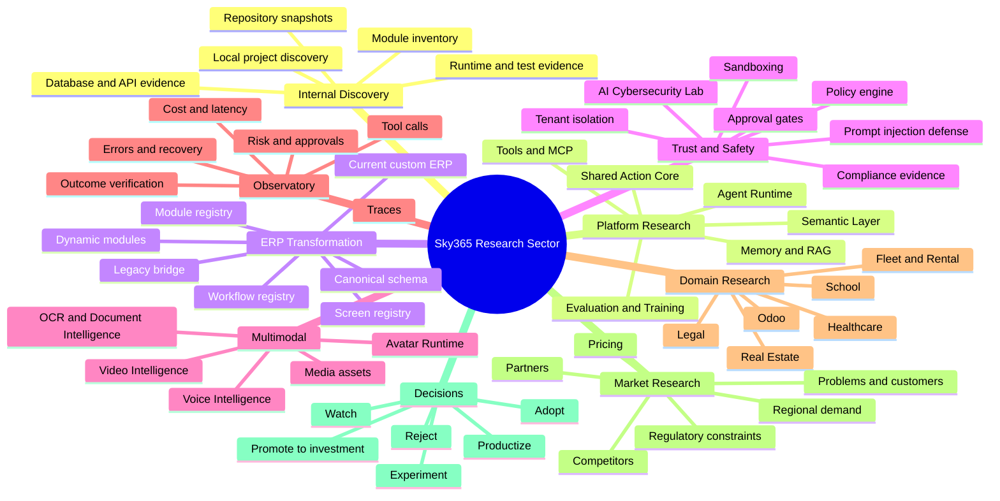

# Sky365 Research Sector — Mind Map


```mermaid
mindmap
  root((Sky365 Research Sector))
    Internal Discovery
      Repository snapshots
      Local project discovery
      Module inventory
      Database and API evidence
      Runtime and test evidence
    Platform Research
      Agent Runtime
      Shared Action Core
      Semantic Layer
      Memory and RAG
      Tools and MCP
      Evaluation and Training
    ERP Transformation
      Current custom ERP
      Canonical schema
      Module registry
      Screen registry
      Workflow registry
      Legacy bridge
      Dynamic modules
    Trust and Safety
      AI Cybersecurity Lab
      Prompt injection defense
      Sandboxing
      Tenant isolation
      Policy engine
      Approval gates
      Compliance evidence
    Multimodal
      OCR and Document Intelligence
      Voice Intelligence
      Video Intelligence
      Avatar Runtime
      Media assets
    Observatory
      Traces
      Tool calls
      Cost and latency
      Risk and approvals
      Errors and recovery
      Outcome verification
    Domain Research
      School
      Healthcare
      Legal
      Real Estate
      Fleet and Rental
      Odoo
    Market Research
      Problems and customers
      Competitors
      Partners
      Pricing
      Regional demand
      Regulatory constraints
    Decisions
      Adopt
      Watch
      Reject
      Experiment
      Productize
      Promote to investment
```

## Research outputs

```text
Evidence Pack
+ Research Track
+ Decision Record
+ Experiment Result
+ Product Recommendation
+ Investment Readiness Score
```
